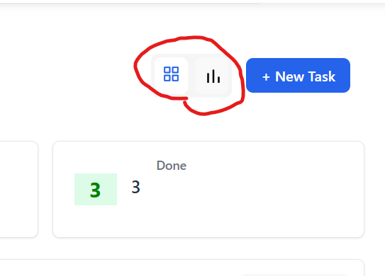
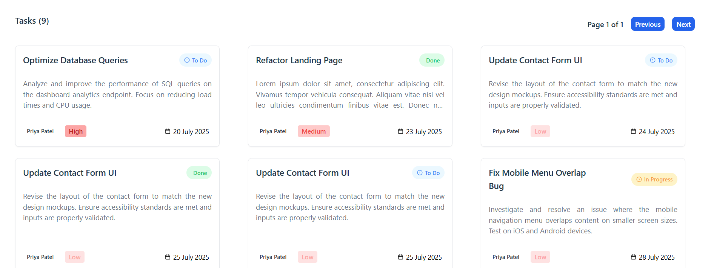
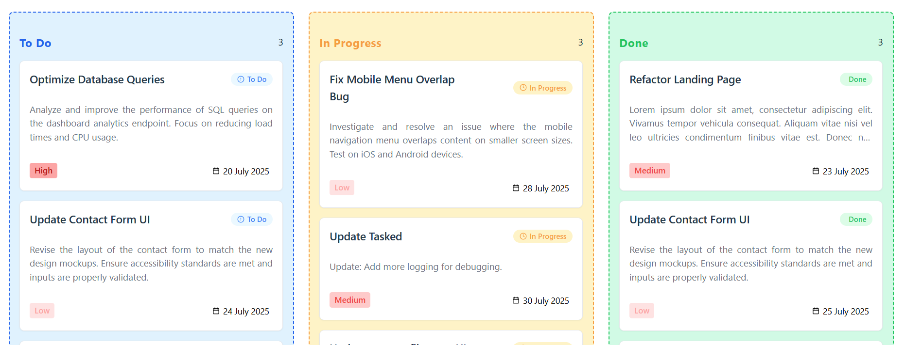
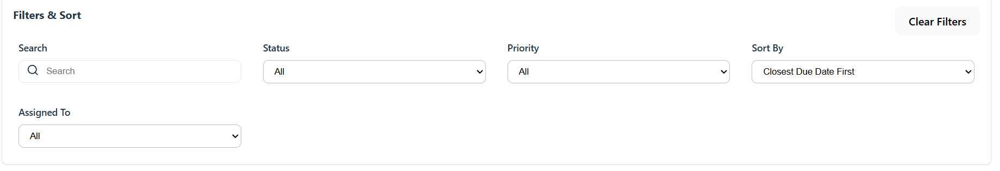
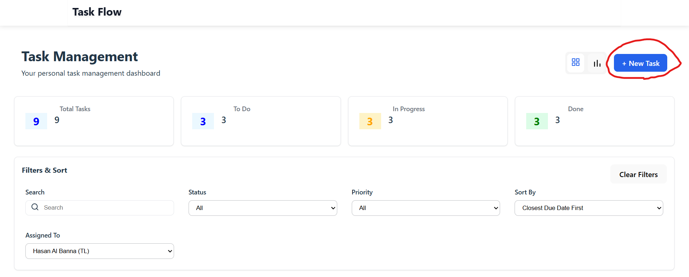
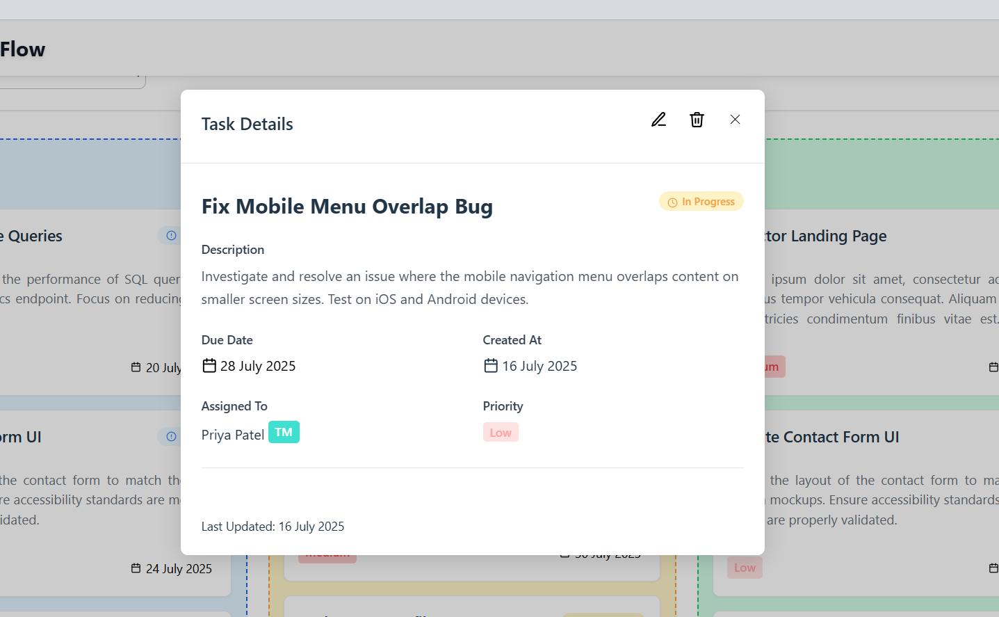
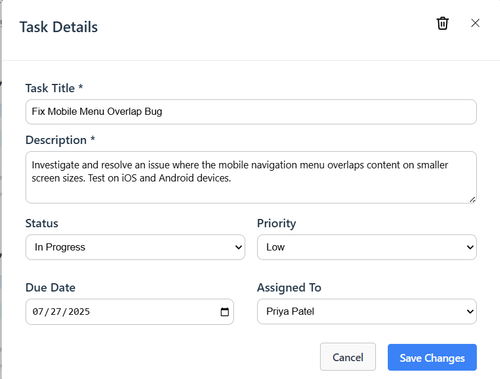

Create and Maintained by: Hasan Al Banna
github link: https://github.com/albannahasan/task_management_kpmg

## About
This project is an MVP for a task management system that aims to centralize and streamline project management. The UI is designed to be easy to access and allows different users to:

- Team Members: Need to manage their own tasks and update progress
- Team Leads: Want visibility into what their team is working on
- Project Managers: Need to ensure deadlines are met and workloads are balanced

## Environment Setup (Requirements)

Before running the task management project, ensure that these requirements are met:
- **Node.js** (recommended version: 18.x or later)  
  To check the version:  
    ```
    node -v
    ```

- **.NET SDK** (recommended version: 8.0 or later)  
  To check the version:  
    ```
    dotnet --version
    ```

- **Microsoft SQL Server**

- **SQL Server Management Studio (SSMS)** (recommended for managing and running SQL scripts on a SQL Server instance)

## Setup Instructions
### Step 1: Create the Database 
Run the script to ensure the database exists and it will create automatically if it doesnt :

[task_management_kpmg.Server/Scripts/ensure-db-exists.sql](task_management_kpmg.Server/Scripts/ensure-db-exists.sql)  
*(relative to the project root directory)*

 ```sql
 -- Content of ensure-db-exist.sql
DECLARE @dbName NVARCHAR(128)
SET @dbName = 'TaskDb'

IF NOT EXISTS (
    SELECT name FROM sys.databases WHERE name = @dbName
)
BEGIN
    EXEC('CREATE DATABASE [' + @dbName + ']')
    PRINT 'Database created.'
END
ELSE
BEGIN
    PRINT 'Database already exists.'
END
```

two option of executing the script:

1. Bash

```
sqlcmd -S localhost -d master -i scripts/ensure-db-exists.sql
```

2. Alternatively, the SQL script can be run manually using a graphical tool like SQL Server Management Studio (SSMS) or Azure Data Studio

### Step 2: Configure Connection String
This project uses Dapper (not Entity Framework), and it connects to a Microsoft SQL Server using the connection string in [`task_management_kpmg.Server/appsettings.json`](task_management_kpmg.Server/appsettings.json):

```json
"ConnectionStrings": {
  "DefaultConnection": "Server=localhost\\MSSQLSERVER01;Database=TaskDb;Trusted_Connection=True;TrustServerCertificate=True;"
}

```

#### How to configure:
- Replace localhost\\MSSQLSERVER01 with the user's SQL Server instance name
    - Use localhost, . or localhost\\SQLEXPRESS if using SQL Express.
- Trusted_Connection=True enables Windows Authentication.
    - To use SQL Server authentication instead, use:
```ini
Server=localhost;Database=TaskDb;User Id=sa;Password=your_password;TrustServerCertificate=True;
```

#### Alternate way: Override via environment variable (optional):

Alternatively it is possible to override the connection string by setting an environment variable.

By default, the app reads the connection string from `appsettings.json`. To override, set the environment variable `ConnectionStrings__DefaultConnection` (note the double underscore).

For example (Windows PowerShell):

```powershell
$Env:ConnectionStrings__DefaultConnection="Server=localhost;Database=TaskDb;Trusted_Connection=True;"
dotnet run
```


### Step 3: Run the Backend (Migrations Apply Automatically)


From the root of the project, cd into backend .net directory

```bash
cd task_management_kpmg.Server
```

Once the database exists, to avoid SSL errors, run the command below to trust the ssl certificates


```bash
dotnet dev-certs https --trust
```

and then, we can run the backend using the https launch profile: (Migration will apply automatically):

```bash
dotnet run --launch-profile https
```

### Step 4: Run the Frontend Application
Once the backend is up and running, the front-end is next, return to the project directory and cd to Front end directory


```bash
cd .\task_management_kpmg.Client\
```

Install dependencies 

```bash
npm install 
```

run application, which will be assigned to Port 59247
```bash
npm run dev
```

Open the browser and go to https://localhost:59247 to view the app.

> **Warning:** If you are using Windows 11, please ensure your system theme is set to **Light**. The Windows 11 Light/Dark theme can interfere with the application's UI, causing display issues. Make sure, switch to the Light theme before using the app.


## API Documentation

The API collection file in the form of HAR, named [`api_export_file`](api_export_file), is located in the project root. You can import this file into tools like Postman to explore and test the available endpoints.

---

### Available Endpoints

#### 1. Get All Tasks
- **URL:** `GET /api/tasks`
- **Description:** Retrieves a list of all tasks.
- **Response:** Returns an array of task objects.
- **Example:**
  ```bash
  curl -X GET https://localhost:7232/api/tasks
  ```

#### 2. Get Task by ID
- **URL:** `GET /api/tasks/{id}`
- **Description:** Retrieves a single task by its unique ID.
- **Response:** Returns the task object if found.
- **Example:**
  ```bash
  curl -X GET https://localhost:7232/api/tasks/1
  ```

#### 2. Create a Task
- **URL:** `POST /api/tasks`
- **Description:** Creates a new task with the provided details.
- **Body:**
  ```json
  {
    "title": "Fix user login bug",
    "description": "Users are unable to log in when their passwords contain special characters...",
    "status": "toDo",
    "priority": "high",
    "dueDate": "2025-07-23",
    "assignedTo": "Hasan Al Banna"
  }
  ```

#### 3. Update a Task
- **URL:** `PUT /api/tasks/{id}`
- **Description:** Updates an existing task with the provided details.
- **Body:**
  ```json
  {
    "title": "Fix user login bug",
    "description": "Update: Add more logging for debugging.",
    "status": "inProgress",
    "priority": "medium",
    "dueDate": "2025-07-30",
    "assignedTo":  "Hasan Al Banna"
  }
  ```
- **Example:**
  ```bash
  curl -X PUT https://localhost:7232/api/tasks/1 \
    -H "Content-Type: application/json" \
    -d '{
      "title": "Fix user login bug",
      "description": "Update: Add more logging for debugging.",
      "status": "inProgress",
      "priority": "medium",
      "dueDate": "2025-07-30",
      "assignedTo":  "Hasan Al Banna"
    }'
  ```

#### 4. Delete a Task
- **URL:** `DELETE /api/tasks/{id}`
- **Description:** Deletes a task by its ID.
- **Response:** Returns a success message or status.
- **Example:**
  ```bash
  curl -X DELETE https://localhost:7232/api/tasks/1
  ```

## Usage Examples
> **Warning:** If you are using Windows 11, please ensure your system theme is set to **Light**. The Windows 11 Light/Dark theme can interfere with the application's UI, causing display issues. Make sure, switch to the Light theme before using the app.

> **Note:** When first running the application, some seed data is automatically inserted into the database. This allows user to explore and test the application's features right away without needing to manually create tasks.


### Viewing Tasks

Tasks can be viewed in two main ways. Use the toggle button at the top right corner of the interface to switch between views:

<div align="center">
  
</div>

#### 1. Card View

- Tasks are shown as individual cards in a vertical list.
- Each card displays key details such as title, status, priority, and due date.
- Pagination is supported here, with each page set to contain 9 cards. 

<div align="center">
  
</div>

#### 2. Kanban Board View

- Tasks are organized into columns by status (e.g., To Do, In Progress, Done).
- drag and drop tasks between columns to update their status.

<div align="center">
  
</div>

### Filters
Tasks can be filtered to quickly find what the user need. The available filters include:

- **Status:** Filter by task status (e.g., To Do, In Progress, Done).
- **Priority:** Filter by priority level (e.g., Low, Medium, High).
- **Due Date:** Filter tasks by due date or date range.
- **Assigned To:** Filter tasks assigned to a specific user.

To use filters:

1. Locate the filter bar at the top of the task list or board.
2. Select one or more filter criteria from the dropdowns or date pickers.
3. The task view will automatically update to show only tasks matching selected filters.

<div align="center">
  
</div>

 Multiple filters can be combined to narrow down results. To clear filters, use the "Reset" or "Clear Filters" button next to the filter bar.

### Create Task

Users can fill out the form to create a new task by pressing the new task button on top right with a title, description, due date, priority, and assignment.




#### View, Edit, Delete, and Update Tasks

Task details can be viewed by clicking on it in the list or board. This opens a detail panel or modal showing all task information, including title, description, status, priority, due date, and assignee.

- **View Details:** Click a task to see its full details.
- **Edit Task:** In the detail view, press the "Edit" button to update any field (such as title, description, status, priority, due date, or assignee).
- **Save Changes:** After editing, click "Save" to update the task. The changes will be reflected immediately in the task list or board.
- **Delete Task:**  delete task by pressing the trash icon on the top corner

<div align="center">
  
</div>
<div align="center">
  
</div>


## Assumption and Limitations

When developing this task, there is some assumptions that I took. these includes:

##### Docker
While I usually prefer using Docker for development and deployment due to its consistency and ease of environment management, for the scope  this project, I decided to keep things lightweight and straightforward. This approach reduces setup overhead and makes it easier for contributors to get started quickly without requiring Docker installation.

Should the project grow in complexity or require more robust environment management, Dockerization can be easily added in the future.

#### User
The task specification mainly focuses on the Task object, but it also have a requirements where users (Team Member, Team Lead, Project Manager) will be able to  "Want visibility into what their team is working on" and others. However, since its MVP, i believe that creating a whole Users table will make the project loose the lightweightness, as it requires login system, auth token etc and thus I did not include it.

To demonstrate how different user roles (such as Team Member, Team Lead, and Project Manager) interact with the app, I chose to hard-code a user object in the frontend. I believe this approach maintains the app’s lightweight nature while still allowing key user-specific features to be showcased, without introducing the complexity of a full authentication system.

#### Migration
This project uses Dapper instead of Entity Framework, so database migrations are typically handled with SQL scripts. However, I chose to use FluentMigrator to organize and manage migrations in a more structured and maintainable way.

#### Styling
For styling i usually prefer Tailwind due to its accesibility, however Im not sure if the assesor is familiar and thus i decided to stick with basic css.

#### Kanban View
Although not included in the requirement file, i decided to add a kanban view, as I was inspired by how a lot of task management software utilize this view for improved and better task management system, it is very simplified but I think it serve the purpose as one for MVP. 

#### DTOS and API documentation
For the Backend, i believe it is a good practice to implement Data Transfer Object (DTO), however after implementing it, I cannot see much of a difference between using one and not using one, as the use case is pretty simple, thus i opted on not using DTO. The simplicity of the API is also the reason why I do not use app liek swagger, as i think api documentation in the README is sufficient. 

Additional limitations and assumptions include that the application is designed primarily for small teams and may not scale efficiently for large organizations or high-traffic scenarios; automated testing is minimal, so manual testing is required to ensure stability; mobile responsiveness is basic and the UI may not be fully optimized for all devices; and error handling is simple, which may not cover all edge cases or provide detailed feedback to users.


