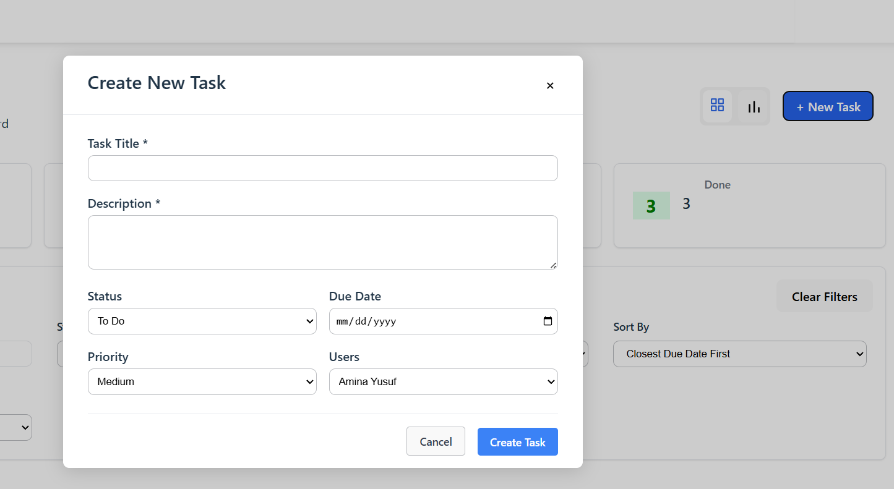

## About
## Environment Setup (Requirements)

Before running the task management project, ensure that these requirements are met:
- **Node.js** (recommended version: 18.x or later)  
  To check the version:  
    ```
    node -v
    ```

- **.NET SDK** (recommended version: 8.0 or later)  
  To check the version:  
    ```
    dotnet --version
    ```

- **Microsoft SQL Server**

- **SQL Server Management Studio (SSMS)** (recommended for managing and running SQL scripts on a SQL Server instance)

## Setup Instructions
### Step 1: Create the Database 
Run the script to ensure the database exists and it will create automatically if it doesnt :

 [`scripts/ensure-db-exists.sql`](task_management_kpmg.Server/Scripts/ensure-db-exists.sql)

 ```sql
 -- Content of ensure-db-exist.sql
DECLARE @dbName NVARCHAR(128)
SET @dbName = 'TaskDb'

IF NOT EXISTS (
    SELECT name FROM sys.databases WHERE name = @dbName
)
BEGIN
    EXEC('CREATE DATABASE [' + @dbName + ']')
    PRINT 'Database created.'
END
ELSE
BEGIN
    PRINT 'Database already exists.'
END
```

two option of executing the script:

1. Bash

```
sqlcmd -S localhost -d master -i scripts/ensure-db-exists.sql
```

2. Alternatively, the SQL script can be run manually using a graphical tool like SQL Server Management Studio (SSMS) or Azure Data Studio

### Step 2: Configure Connection String
This project uses Dapper (not Entity Framework), and it connects to a Microsoft SQL Server using the connection string in [`/appsettings.json`](task_management_kpmg.Server/appsettings.json):

```
"ConnectionStrings": {
  "DefaultConnection": "Server=localhost\\MSSQLSERVER01;Database=TaskDb;Trusted_Connection=True;TrustServerCertificate=True;"
}

```

#### How to configure:
- Replace localhost\\MSSQLSERVER01 with the user's SQL Server instance name
    - Use localhost, . or localhost\\SQLEXPRESS if using SQL Express.
- Trusted_Connection=True enables Windows Authentication.
    - To use SQL Server authentication instead, use:
```ini
Server=localhost;Database=TaskDb;User Id=sa;Password=your_password;TrustServerCertificate=True;
```

#### Override via environment variable (optional):

it is possible to override the connection string by setting an environment variable.

By default, the app reads the connection string from `appsettings.json`. To override, set the environment variable `ConnectionStrings__DefaultConnection` (note the double underscore).

For example (Windows PowerShell):

```powershell
$Env:ConnectionStrings__DefaultConnection="Server=localhost;Database=TaskDb;Trusted_Connection=True;"
dotnet run
```


### Step 3: Run the Backend (Migrations Apply Automatically)


From the root of the project, cd into backend .net directory

```bash
cd task_management_kpmg.Server
```

Once the database exists, to avoid SSL errors, run the command below to trust the ssl certificates


```bash
dotnet dev-certs https --trust
```

and then, we can run the backend using the https launch profile: (Migration will apply automatically):

```bash
dotnet run --launch-profile https
```

### Step 4: Run the Frontend Application
Once the backend is up and running, the front-end is next, return to the project directory and cd to Front end directory


```bash
cd .\task_management_kpmg.Client\
```

Install dependencies 

```bash
npm install 
```

run application, which will be assigned to Port 59247
```bash
npm run dev
```

Open the browser and go to https://localhost:59247 to view the app.


## API Documentation

The API collection file can be found inside the `HAR` directory. Import this file into tools like Postman to explore and test the available endpoints.

---

### Available Endpoints

#### 1. Get All Tasks
- **URL:** `GET /api/tasks`
- **Description:** Retrieves a list of all tasks.
- **Response:** Returns an array of task objects.
- **Example:**
  ```bash
  curl -X GET https://localhost:7232/api/tasks
  ```

#### 2. Get Task by ID
- **URL:** `GET /api/tasks/{id}`
- **Description:** Retrieves a single task by its unique ID.
- **Response:** Returns the task object if found.
- **Example:**
  ```bash
  curl -X GET https://localhost:7232/api/tasks/1
  ```

#### 2. Create a Task
- **URL:** `POST /api/tasks`
- **Description:** Creates a new task with the provided details.
- **Body:**
  ```json
  {
    "title": "Fix user login bug",
    "description": "Users are unable to log in when their passwords contain special characters...",
    "status": "toDo",
    "priority": "high",
    "dueDate": "2025-07-23",
    "assignedTo": "Hasan Al Banna"
  }
  ```

#### 3. Update a Task
- **URL:** `PUT /api/tasks/{id}`
- **Description:** Updates an existing task with the provided details.
- **Body:**
  ```json
  {
    "title": "Fix user login bug",
    "description": "Update: Add more logging for debugging.",
    "status": "inProgress",
    "priority": "medium",
    "dueDate": "2025-07-30",
    "assignedTo":  "Hasan Al Banna"
  }
  ```
- **Example:**
  ```bash
  curl -X PUT https://localhost:7232/api/tasks/1 \
    -H "Content-Type: application/json" \
    -d '{
      "title": "Fix user login bug",
      "description": "Update: Add more logging for debugging.",
      "status": "inProgress",
      "priority": "medium",
      "dueDate": "2025-07-30",
      "assignedTo":  "Hasan Al Banna"
    }'
  ```

#### 4. Delete a Task
- **URL:** `DELETE /api/tasks/{id}`
- **Description:** Deletes a task by its ID.
- **Response:** Returns a success message or status.
- **Example:**
  ```bash
  curl -X DELETE https://localhost:7232/api/tasks/1
  ```

## Usage Examples

> **Note:** When first running the application, some seed data is automatically inserted into the database. This allows user to explore and test the application's features right away without needing to manually create tasks.


### Viewing Tasks

Tasks can be viewed in two main ways. Use the toggle button at the top right corner of the interface to switch between views:

<div align="center">
  
</div>

#### 1. Card View

- Tasks are shown as individual cards in a vertical list.
- Each card displays key details such as title, status, priority, and due date.

<div align="center">
  
</div>

#### 2. Kanban Board View

- Tasks are organized into columns by status (e.g., To Do, In Progress, Done).
- drag and drop tasks between columns to update their status.

<div align="center">
  
</div>

### Filters
Tasks can be filtered to quickly find what the user need. The available filters include:

- **Status:** Filter by task status (e.g., To Do, In Progress, Done).
- **Priority:** Filter by priority level (e.g., Low, Medium, High).
- **Due Date:** Filter tasks by due date or date range.
- **Assigned To:** Filter tasks assigned to a specific user.

To use filters:

1. Locate the filter bar at the top of the task list or board.
2. Select one or more filter criteria from the dropdowns or date pickers.
3. The task view will automatically update to show only tasks matching selected filters.

<div align="center">
  
</div>

 Multiple filters can be combined to narrow down results. To clear filters, use the "Reset" or "Clear Filters" button next to the filter bar.

### Create Task

Users can fill out the form to create a new task by pressing the new task button on top right with a title, description, due date, priority, and assignment.





#### View, Edit, Delete, and Update Tasks

Task details can be viewed by clicking on it in the list or board. This opens a detail panel or modal showing all task information, including title, description, status, priority, due date, and assignee.

- **View Details:** Click a task to see its full details.
- **Edit Task:** In the detail view, press the "Edit" button to update any field (such as title, description, status, priority, due date, or assignee).
- **Save Changes:** After editing, click "Save" to update the task. The changes will be reflected immediately in the task list or board.
- **Delete Task:**  delete task by pressing the trash icon on the top corner

<div align="center">
  
</div>
<div align="center">
  
</div>


## Assumption and Limitations
